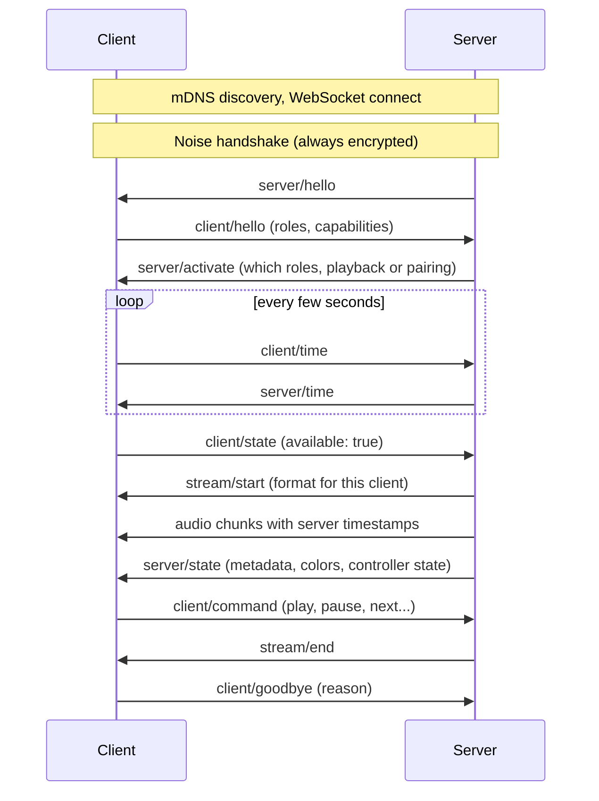

This chapter gives you the picture the specification assumes you already have. Each section ends with a link to the part of the [specification](/build/spec/) that defines it.

## Clients and servers

A **client** is an endpoint on the network. It receives audio from a server, or, with the source role, captures audio and hands it to a server. A client is a speaker, an amplifier, a streamer, a wall display, a light, a browser tab, a CLI player on a Raspberry Pi.

A **server** is the brain. It decides what plays where, encodes a stream for every client, keeps all of them on one timeline and knows about groups, volume and metadata. The server is the only place where audio is mixed, resampled or transcoded. Music Assistant is a server. A phone app that streams the music it plays to the speakers in the room is a server too.

A **role** is a capability a client opts into: `player` receives audio, `controller` sends transport commands, `metadata` shows what plays, and so on. A client advertises the roles it supports; the server activates the ones it wants to use. Every server implements every role, so a client never has to worry about a server that cannot handle what it offers. The [roles chapter](/build/guide/roles/) goes through them one by one.

One device can hold several of these positions at once. A set-top box is a player when music plays, a source when it feeds TV audio into the system, and can embed a server to drive the other speakers in the room itself.

Keep clients simple

Most design decisions in Sendspin push complexity to the server. Clients announce what they can do and the server adapts: it picks the codec per client, resamples for clients that cannot, and lets every client in a group use a different format. If you are building a device, this is what lets a microcontroller keep up with a desktop.

Spec: [Definitions](/build/spec/#definitions), [Role Versioning](/build/spec/#role-versioning).

## A session, end to end

Everything after the handshake is JSON text messages for control and small binary messages for audio, artwork and visualizer data, all inside one WebSocket connection.

Spec: [Protocol overview](/build/spec/#protocol-overview), [Communication](/build/spec/#communication).

## Discovery and connection

Both sides announce themselves with mDNS. In the recommended setup the **server connects to the client**: the client advertises `_sendspin._tcp` with a small WebSocket server, and every server on the network finds it and connects. Clients can also do it the other way around and connect to a server advertising `_sendspin-server._tcp`. Servers support both; a client picks one.

Why server-initiated? Because it is the only mode with defined behaviour when there is more than one server on the network. A client can be connected to several servers at once but takes playback from one at a time. A server that is playing outranks one that only wants to be connected, a pairing attempt is never interrupted, and the client remembers the server it last played from. Two servers in one home, say Music Assistant and a phone app, therefore cooperate without any configuration.

The WebSocket itself is plain `ws://`. All confidentiality comes from the layer inside it.

Spec: [Establishing a Connection](/build/spec/#establishing-a-connection), [Multiple servers](/build/spec/#multiple-servers-server-initiated).

## Encryption and identity

Every Sendspin connection is encrypted with the Noise protocol framework (pattern `KKpsk2`, X25519 keys, ChaCha20-Poly1305 or AES-GCM). There is no unencrypted mode.

Each client and each server has a long-lived keypair. The public key, encoded as text, is the `client_id` or `server_id`. It is the device's identity, so it is created once and persisted for the life of the device. Replacing the key means becoming a different device as far as everyone else is concerned.

The handshake mixes in a pre-shared key. Which key is used tells both sides how much they trust each other:

- A **long-term PSK** from a previous pairing: both sides know exactly who the other is. This is a *paired* session.
- The device's **pairing PSK**: the operator has entered the device's pairing token, so the server is trusted; used once to complete pairing.
- The published **Sentinel PSK**: nobody has proven anything yet. This is an *unpaired* session, good enough to play music on a speaker if the manufacturer allows it, and the starting point for code-based pairing.

Spec: [Encryption](/build/spec/#encryption), [Pre-Shared Key](/build/spec/#pre-shared-key).

## Pairing and unpaired access

Pairing is the one-time step that turns an unpaired session into a paired one. There are three methods: a **pairing PSK** printed on the device or shown in an app, a **dynamic pairing code** the device displays or speaks during the attempt, and a **static pairing code** printed on devices that have no display or speaker to show one. Servers implement all three; clients implement the pairing PSK and add the method that fits their hardware.

Pairing is not required to play music. A client can admit **unpaired access**: any server the operator approves may play on it, exactly like a cast target in the home today. Whether a device ships with unpaired access on is the manufacturer's call. Devices with a microphone or another privacy-sensitive input should ship with it off, and the source role always needs explicit approval from the operator before anything leaves the device.

The [trust model chapter](/build/guide/pairing-and-encryption/) explains the security properties. The [client pairing](/build/guide/client/pairing/) and [server UX](/build/guide/server/ux/) chapters cover what to build.

Spec: [Pairing](/build/spec/#pairing), [Unpaired Access](/build/spec/#unpaired-access).

## Time

Sendspin does not stream audio "now". Every audio chunk carries the server-clock time at which it must come out of the speaker. Clients keep a continuous estimate of the server clock by exchanging small time messages and feeding the results into the **time filter**, a two-dimensional Kalman filter that tracks offset and drift. The filter is mandatory and there is a [reference implementation](https://github.com/Sendspin/time-filter) you can use as is.

Because every client translates the same server timestamps to its own clock, a dozen speakers of different makes play the same sample within a fraction of a millisecond of each other. A player reports itself as available only once its filter has converged, and from then on it owns its own synchronization: measure the error at the output, correct it inaudibly, and drop audio that arrives too late.

Spec: [Clock Synchronization](/build/spec/#clock-synchronization), [Playback Synchronization](/build/spec/#playback-synchronization).

## Streams, chunks and buffers

For each client with an active player role the server opens a **stream**: a format (codec, sample rate, channels, bit depth) chosen from what that client supports, followed by **chunks** of 15 to 150 ms of encoded audio, each with a timestamp. A client tells the server how much it can buffer and how far ahead it needs audio to start cleanly and to ride out network jitter. The server sends as far ahead as the buffer allows for music from a library, and as little ahead as it can for live input such as a turntable or a TV.

The queue is one continuous stream. Track changes do not restart it, which is what makes gapless playback and crossfades work. A seek or a jump to another track clears the buffer and the stream continues from the new position.

Spec: [`stream/start`](/build/spec/#server--client-streamstart), [Server Audio Send Constraints](/build/spec/#server-audio-send-constraints).

## Groups

Every client is in exactly one **group** at all times, even if it is alone in it. A group has a playback state, a volume and a mute state, and its members play the same audio. Grouping is a server-side concept: clients only see `group/update` messages telling them which group they are in and what it is doing. A controller client sends its commands to its own group; a `switch` command moves it to the next group that is playing.

When something else takes over a device, say the user switches the TV to HDMI, the client either leaves the group (if Sendspin could still take it back any time) or reports itself unavailable (if it will not yield). The server parks it in its own stopped group and remembers where it came from, but never pulls it back in on its own.

Spec: [`group/update`](/build/spec/#server--client-groupupdate), [External Source Handling](/build/spec/#external-source-handling), [Switch command cycle](/build/spec/#switch-command-cycle).

## Versioning and evolution

Roles are versioned (`player@v1`) and evolve independently of the protocol as a whole. A client lists the versions it supports, most preferred first, and the server picks the newest one it implements. Everyone ignores fields and messages they do not know, which is how the protocol gains features without breaking what already ships. Behaviour only changes when both sides have explicitly agreed to it through role activation or a declared capability.

You can add your own roles under a `_vendorname_` prefix for features specific to your products, and the project uses the same mechanism to try out draft roles before they enter the specification.

Spec: [Role Versioning](/build/spec/#role-versioning), [Protocol evolution](/build/spec/#protocol-evolution), [Application-Specific Roles](/build/spec/#application-specific-roles).

## Glossary

| Term | Meaning |
|---|---|
| `client_id`, `server_id` | The public half of a device's identity keypair, as text. Stable for the life of the device. |
| Pairing record | A long-term PSK stored with the peer's id after a successful pairing. Clients hold at least five. |
| Pairing PSK | A secret the device is manufactured with (or generates on first boot), distributed together with its `client_id` as a pairing token. |
| Pairing token | The text or QR form of the pairing PSK, starting with `SP:`. |
| Sentinel PSK | A published constant used when no trust exists yet. Marks a session as unpaired. |
| Out-channel | The way a device shows a dynamic pairing code to the person standing next to it: a display or a speaker. |
| Activity | What a server declares it wants from a connection: `playback`, `pairing`, or nothing yet. Decides priority between servers. |
| Unpaired access | A client's willingness to let approved servers play on it without pairing. |
| Group | The set of clients playing the same thing. Each client is always in exactly one. |
| Send-ahead | How far before its timestamp the server transmits a chunk. Derived from the clients' buffer requirements. |
| Output delay | The fixed delay a client adds for everything after its audio port, such as an external amplifier. |
