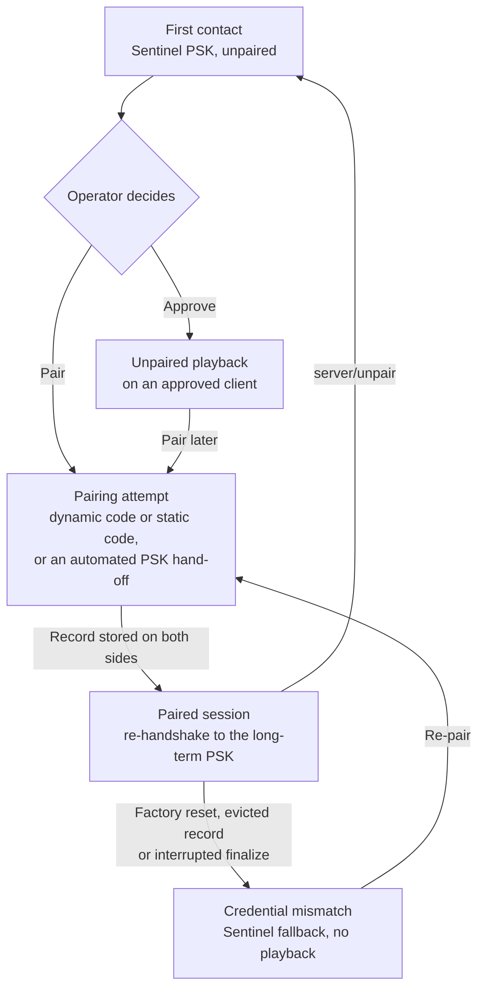

This chapter is for the engineer who implements the handshake and for the person who has to sign off on it. It explains what the protocol guarantees, what it leaves to the operator, and where the limits are. The flows themselves are in the [server UX](/build/guide/server/ux/) and [client pairing](/build/guide/client/pairing/) chapters.

## Encrypted, always

Every Sendspin connection is encrypted. There is no plaintext mode and no downgrade: a peer that cannot complete the handshake gets no session at all. Encryption gives you confidentiality (nobody on the network reads the audio or the metadata), integrity (a modified message fails authentication and ends the connection) and replay protection (a repeated or reordered message fails the same way). Ephemeral keys in every handshake add forward secrecy, so a key stolen tomorrow does not decrypt the traffic recorded today.

What encryption does not give you on its own is knowledge of who is on the other end. A secure channel to an unknown party is still a channel to an unknown party. That is what pairing adds.

Spec: [Encryption](/build/spec/#encryption), [Pattern](/build/spec/#pattern).

## The pieces

**Noise `KKpsk2`.** A fixed handshake pattern from the Noise framework. Both sides know each other's static public key before the handshake starts, and a pre-shared key is mixed in at the end of the second message. The server is always the Noise initiator, whichever side opened the WebSocket.

**Two cipher suites.** ChaCha20-Poly1305 is fast in software and the natural choice on a microcontroller. AES-GCM uses the hardware acceleration of larger chips. Servers implement both; a client picks one and announces it, so there is no negotiation to get wrong.

**Identities.** The X25519 static public keys are the identities. Encoded as text they are the `client_id` and the `server_id`. Changing the key means becoming a different device.

**The PSK slot** carries one of three kinds of key, and which kind tells both sides how much they trust each other:

- The **Sentinel PSK** is a published constant. It means no trust has been established; the session is unpaired.
- The **pairing PSK** is a secret the device was manufactured with or generated on first boot, handed to a server out of band as a pairing token by a system that already knows the device. It is used once per server to pair, without any code for a person to enter.
- A **long-term PSK** is the output of a successful pairing, stored on both sides as a pairing record. It means both sides have proven who they are before.

**The prologue** mixes the cleartext opening messages into the handshake, so tampering with them breaks it. **Re-handshake** reruns the pattern inside a live connection with a different PSK, which promotes a session from unpaired to paired without dropping the stream.

Spec: [Cipher Suites](/build/spec/#cipher-suites), [Identities](/build/spec/#identities), [Pre-Shared Key](/build/spec/#pre-shared-key), [Prologue](/build/spec/#prologue), [Re-handshake](/build/spec/#re-handshake).

## Three ways to pair

**Pairing PSK.** A system that already knows the device hands its pairing token to the server: Home Assistant passing an ESPHome device's secret to Music Assistant, or a platform provisioning its own servers. The token carries the `client_id` and the pairing PSK together, so the server knows which device it is talking to and holds a secret only that device has. The handshake with that PSK authenticates both sides from the first byte, and no person enters anything. The flip side: whoever holds the token can pair. Keep it inside the owner's own platform, protect it the way you protect a Wi-Fi password, and never print it where a visitor can photograph it.

**Dynamic pairing code.** The device shows or speaks a six-digit code that exists only for this attempt. It is derived from the handshake hash and two nonces, one committed by the device before it sees the server's, so neither side can steer it. The code feeds a PAKE, CPace, which lets both sides prove they hold the same code without sending it. A wrong code fails the proof and learns nothing. A man in the middle relaying between two handshakes has two different handshake hashes and therefore two different codes, and fails on both legs. The new long-term PSK crosses the wire wrapped under the PAKE output, so only the party that completed the proof can read it.

**Static pairing code.** The same PAKE, but the eight-digit code is fixed and printed on the device, so anyone who learns it can pair. Two things bound the exposure: an attempt needs an operator gesture on the device that opens a pairing window, and the window closes after five failed attempts. It exists for devices with no display or speaker; a device that has one should use the dynamic code.

Spec: [Methods](/build/spec/#methods), [Pairing PSK Flow](/build/spec/#pairing-psk-flow), [Dynamic Pairing Code Flow](/build/spec/#dynamic-pairing-code-flow), [Static Pairing Code Flow](/build/spec/#static-pairing-code-flow), [PAKE](/build/spec/#pake), [Wrapping](/build/spec/#wrapping).

## Unpaired access and its risk

A Sentinel session is encrypted, but neither side knows to whom. Someone on the same network can impersonate the speaker to the server, or the server to the speaker, and relay between them. For music on a living room speaker that risk is accepted every day in the form of cast targets, so a device may admit unpaired access and a server may use it once its operator approves the device.

For an input the calculus is different: an attacker in the middle of an unpaired source session hears the room. The source role therefore needs explicit operator approval, never approval implied by pressing play, and a device with a microphone or any other privacy-sensitive input ships with unpaired access off. Pairing closes the gap; from then on the server knows it is talking to the device it paired and nothing else.

Spec: [Unpaired Access](/build/spec/#unpaired-access), [Source messages](/build/spec/#source-messages).

## The life of a trust relationship

When a server references a record the client no longer holds, the client completes the handshake with the Sentinel key instead of failing, and the server learns, authenticated by the client's static key, that its credential was not usable. Neither side deletes anything on that signal alone. The server does not play on the device while its record exists; it surfaces the problem and offers re-pairing. A server that quietly fell back to unpaired playback would let an attacker downgrade a paired device by making it forget.

Spec: [Sentinel Fallback](/build/spec/#sentinel-fallback), [Pairing Records](/build/spec/#pairing-records).

## What to keep, and what losing it costs

On the **client**: the identity keypair, the pairing PSK, the static pairing code if it has one, at least five pairing records, the last-playback server, the unpaired-access setting and the round counter. Lose the keypair and the device is a stranger to every server. Lose the records and every paired server sees a mismatch and asks to re-pair. Lose a pairing PSK the device generated itself and any platform holding its token can no longer pair it; a factory reset restores a manufactured one. Reset the round counter on every boot and a power cycle becomes the gesture the limit relies on, so persist it.

On the **server**: the identity keypair, the pairing records and the approvals. Lose the keypair and you are a new server; records filed under the old identity are useless, and every device has to be paired again. Lose the records and your paired devices still hold theirs, but you connect as a stranger and the operator re-pairs. Lose the approvals and the operator re-approves. Back up the keypair and the records together, or neither.

Spec: [Identities](/build/spec/#identities), [Pairing Records](/build/spec/#pairing-records), [Definitions](/build/spec/#definitions).

## Brute force and cooldowns

The dynamic code has a million values and is fresh per attempt; a guess is a round, and after twenty failed rounds the device holds attempts back until a deliberate operator action. The static code has a hundred million values, five attempts per window, and every window needs a gesture. Both are far beyond what anyone can guess over a network.

Clients should add a cooldown between failed rounds anyway, because the limits assume the gesture is deliberate. Consider a speaker whose gesture is cheap, say the count resets on reboot and the speaker hangs off a smart plug. An attacker on the network can run rounds back to back, and a million-value code falls in about a day. Today that buys a stranger the right to play music. Next year a firmware update adds a microphone, and the attacker's pairing record from the permissive days is indistinguishable from the owner's. Nobody notices, and a factory reset is the only cure. A cooldown that starts at a few seconds and doubles per failed round turns the same search from a day into decades, at no cost to an operator who mistypes twice.

Spec: [Rounds](/build/spec/#rounds), [Pairing Window](/build/spec/#pairing-window).

## For the compliance file

The round limit, the window and attempt limits, and the cooldown are what a test lab can point at when it asks how authentication resists brute force; ETSI EN 303 645 provision 5.1-5 and EN 18031-1 mechanism AUM-6 ask that question. Document the limits your firmware enforces and the gesture that resets them. Per-device identity keys, pairing PSKs and static codes drawn from a CSPRNG answer the provisions on universal default credentials.

A device can go further and keep Sendspin disabled until a per-device credential exists, so it never answers on the network without an identity. ESPHome offers an action for this, which lets you build EN 18031-style defaults without changing the protocol.

## Harden the decoders

Encryption authenticates the channel, not the content. A chunk from an unpaired peer, or from a paired peer that was compromised, is untrusted input to your FLAC or Opus decoder, and both decoders have had CVEs. Fuzz your decode path like any network-facing parser, bound every buffer by the declared size, and keep the decoder where a crash takes down a stream rather than the server.

## Where to look next

The recorded pairing and onboarding flows live in [What users expect from a server](/build/guide/server/ux/). The device-side choices, which methods to offer and how to show a code, are in [client pairing](/build/guide/client/pairing/). The normative text for everything above starts at [Pairing](/build/spec/#pairing) in the specification.
